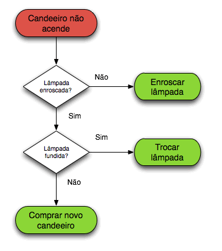

# Algoritmo, Fluxograma e Lógica da Programação

## Algoritmo

Os algorirmos são uma sequência de regras, passos lógicos finitos que representam a resolução de um problema ou a realização de uma tarefa. Detro do mundo de TI mais especificamente na área de Desenvolvimento de Sistemas o algoritmo é a lógica por trás das linhas de código, o algoritmo é como um motor do software mandando no comportamento e nas regras de um aplicativo, site ou sistema operacional.

## Fluxograma

Os fluxogramas no mundo da programação são muito importantes para compreendermos os conceitos base. O fluxograma no mundo da programação são básicamentes estruturas lógicas visuais que refletem o processo ou algoritmo, inicialmente é muito comum quando á a iniciação na área, o fluxograma ser um dos primeiros contados pois ajuda muito na compreenção mais rápida da lógica por trás da programação. Em resumo o fluxograma é o reflexo do código ou processo, na sua forma lógica, diferente de um algoritmo ele segue um formato especifico para reflexão de um código ou um processo.

Exemplo Fluxograma: 

Esse formato de cada evento tem uma motivação, cada formato simboliza um evento, essa é a grande diferença de um algoritmo (sequência de passos lógicos) e um fluxograma (estruturas visuais que refletem um processo ou algoritmo) o processo do fluxograma contêm suas semanticas atráves das formas.

## Lógica da Programação 

A lógica da programação é um conceito relacionado a organização do pensamento durante a criação de um código. A lógica da programação é básicamente um modo de organização lógica que organiza o pensamento para a criação de resolução de problemas no mundo da programação, ele ajuda a organizar e pensar de forma lógica para criação de códigos ou estruturas de forma simples e eficiênte. Existem diversas maneiras de aprender e estimular a lógica da programação, uma dessas maneiras é o aprendizado de coneitos e ferramentas como algoritmos, fluxograma e Portugol esses conceitos e ferammentas ajudam na construção de um pensamento linear, consequentemente trazendo mais facilidade e simplisidade na criação de estruturas ou códigos.

## Portugol Studio

O Portugol Studio é um ambiente gráfico de desenvolvimento utilizada no aprendizado para iniciantes na área da programação. O Portugol Studio estimula o aprendizado da lógica da programação aplicando atráves de uma interface gráfica uma pseudolinguagem em Português (Portugol) que ensina a lógica da programação e o entendimento de como funciona a estrutura de uma linguagem da programação, a ideia principal do Portugol é de forma simples ensinar falantes da lingua portuguesa como funciona a programação.
