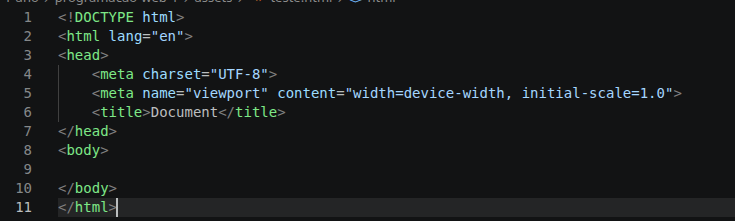

# Introdução ao HTML5

## Estrutura base 

O cabeçalho é a base para construção de uma aplicação que utiliza HTML. O cabeçalho é a base da construção de uma aplicação separada em blocos que chamamos de elemento HTMl, esses elementos desempenham funções dentro do cabeçalho que são separadas pela parte que concentra os elementos cmo conexões e cemanticas `<head>` e a parte que é adicionado os elementos visuais da aplicação `<body>`. Esses dois elementos são a base do nosso cabeçalho, o cabeçalho é bem simples visualmente e lógicamente falando:

exemplo: 

Nessa imagem podemos ver um exemplo um pouco mais simples de ser explicado e executado, com um simples comando no Visual Studio Code podemos duplicar o cabeçalho do exemplo `html:5`, sabendo disso para melhor compreensão vamos a explicação por blocos:

`<!DOCTYPE>`: O comando serve para informar o navegador qual a versão do HTML utilizado, isso facilita e garante a visualização e execução sem erros do navegador;

`<html lang="..." >`: O comando apresentado serve para informar a linguagem da página e a raiz do documento. A tag lang que acompanha o html funciona para informar que a página utiliza a linguagem que se encontra ente aspas, isso facilita o navegador indicar a página conforme o cliente e o leitor ler a tela com idioma padrão. O comando html que é o principal funciona como raiz do cabeçalho inteiro delimitando o código HTMl e organizando a estrutura por completo;

`<head>`: A estrutura head é o cérebro da página atuando como o local que fica as configurações, intruções e metadados da página, esse local geralmente acomoda comandos como `<meta charset="UTF-8">` utilizado para correção ortografica correta da página e `<link rel="stylesheet">` utilizado para importação dos arquivos CSS, alem desse dois comandos a muitos outros que o head é responsável;

`<body>`: A estrutura body é o front do site, a estrutura body é onde fica tudo que vai aparecer na página, sendo o local que acomoda as imagens, textos e mídias da página.

## Estrutura de comandos

A estrutura de comando consiste na abertura e o fechamento de chaves "<>". No HTMl a forma que utilizamos para criar ou dar ordens no geral é atraves da abertura `
` e o fechamento `
`, assim como as estruturas apresentadas no exemplo os codigos seguem a mesma lógica, além disso temos parametros para alguns codigos, por exemplo em uma adição de imagem `` o src é o parametro que decide o caminho para pegar a imagem. alguns códigos são muito importantes para construção de uma interface simples:

``: O comando img serve para adicionar uma imagem apartir do src que é onde fica o caminho;

`<h1>texto</h1>`: O comando h1 é utilizado para aumentar textos, tendo seus sucessores h2, h3, h4...;

`
texto
`: O comando p é utilizado na criação de textos longos, geralmente serve para representar textos grandes;

`

`: A div é utilizada para criação de espaços onde ficaram um conjunto de elementos ou um elemento;

`<class="">`: O parametro class é utilizado para nomear um conjunto de elementos ou um elemento, isso serve para identificar ele dentro do arquivo CSS.

Esses comandos são apenas uma parte doque veremos posteriormente, isso é apenas os comandos mais utilizados para criação de uma estrutura simples.